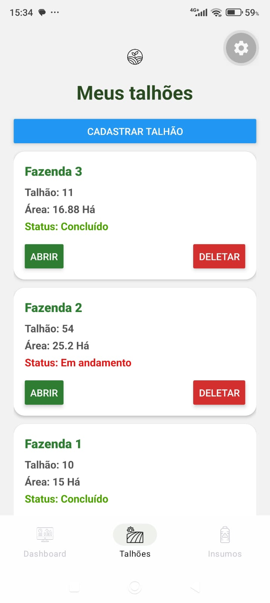
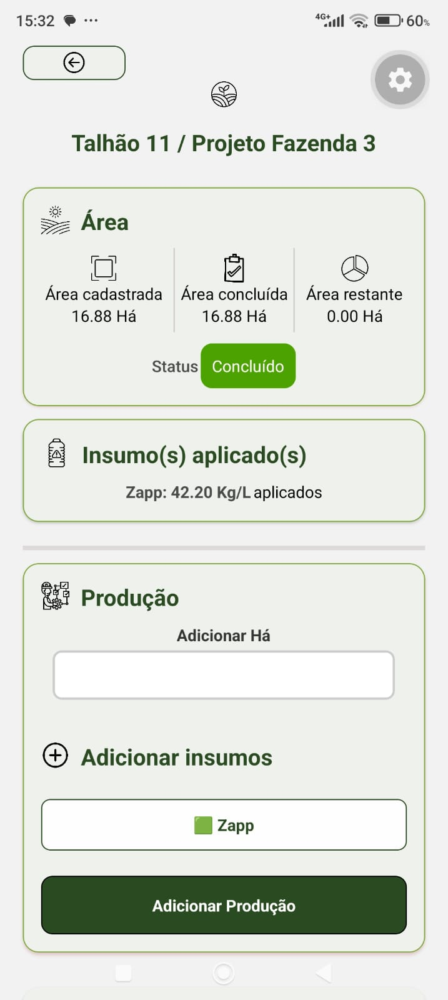

# 🌱 AgroAZ

Aplicativo mobile para **gerenciamento de talhões e operações agrícolas**, desenvolvido com React Native e Expo.

## 📱 Sobre o projeto

O **AgroAZ** foi desenvolvido para facilitar o acompanhamento das operações realizadas em talhões agrícolas, permitindo registrar informações sobre áreas, insumos, aplicações e produção.

Esta é a **primeira versão funcional** do projeto.

## 🚀 Funcionalidades

* 🌱 Cadastro e gerenciamento de talhões
* 📐 Controle da área cadastrada
* 📊 Controle de área produzida e área restante
* 🧪 Gerenciamento de insumos
* 🚁 Registro de aplicações de insumos
* 📋 Histórico de produções
* ✅ Atualização automática do status dos talhões
* 💾 Armazenamento local dos dados com SQLite

## 📸 Screenshots

### 🏠 Dashboard


### 🌱 Lista de Talhões



### 📋 Gerenciamento do Talhão



## 🛠️ Tecnologias utilizadas

* **React Native**
* **Expo**
* **TypeScript**
* **SQLite**
* **Expo Router**

## 💾 Banco de dados

O aplicativo utiliza **SQLite** para armazenamento local dos dados.

Principais tabelas:

```text
talhoes
insumos
aplicacoes
producoes
```

## 🎯 Objetivo

O projeto tem como objetivo colocar em prática conhecimentos adquiridos durante minha formação em **Engenharia de Software**, explorando desenvolvimento mobile, persistência de dados, organização de componentes e construção de interfaces.

O AgroAZ continuará recebendo melhorias e novas funcionalidades conforme o desenvolvimento do projeto avançar.

## 👨‍💻 Desenvolvedor

**João Vitor Gonçalves**

Projeto desenvolvido para fins de aprendizado e desenvolvimento profissional.

---

⭐ Se você gostou do projeto, considere deixar uma estrela no repositório.
